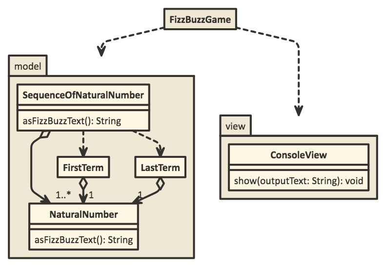

# FizzBuzzをOOPに忠実に実装する

## FizzBuzzとは？

Wikipediaを見ましょう。

Fizz Buzz(wikipedia) https://ja.wikipedia.org/wiki/Fizz_Buzz

### 実行結果の例

仮に、1から100までFizzBuzzGameを続けると、

```text
1 2 Fizz 4 Buzz Fizz 7 8 Fizz Buzz 11 Fizz 13 14 FizzBuzz 16 17 Fizz 19 Buzz Fizz 22 23 Fizz Buzz 26 Fizz 28 29 FizzBuzz 31 32 Fizz 34 Buzz Fizz 37 38 Fizz Buzz 41 Fizz 43 44 FizzBuzz 46 47 Fizz 49 Buzz Fizz 52 53 Fizz Buzz 56 Fizz 58 59 FizzBuzz 61 62 Fizz 64 Buzz Fizz 67 68 Fizz Buzz 71 Fizz 73 74 FizzBuzz 76 77 Fizz 79 Buzz Fizz 82 83 Fizz Buzz 86 Fizz 88 89 FizzBuzz 91 92 Fizz 94 Buzz Fizz 97 98 Fizz Buzz
```

上記の結果が得られる。

## とりあえずベタに実装してみる

* 最低限の仕様を決める
  * プログラムは開始と終了の数を受け取る。
  * 結果は、画面をわざわざつくるのも面倒なので、コンソールへ出力する。
  * 上で示した結果が得られるように、一つ一つの結果はスペースで区切って出力する。

[ソースコード](./src/fizzbuzz/transactionscript/FizzBuzzGame.java)

## OOPとは？

オブジェクト指向プログラミング  
OOP(Object Oriented Programing)

* データとふるまいを持つ「オブジェクト」を組み合わせることによって、機能を実現する。
* オブジェクトはプログラムの「関心事」を表現し、「単一の責務」を果たす。
* 機能を実現するために「手続きを記述する」のではなく「関心事をオブジェクトモデル化する」という考え方をする。
* 「手続きを記述する」アプローチはTransaction Scriptと呼ばれる。気を抜くとこちらになりがち（上の実装がまさにこれ）。

今回はFizzBuzzゲームを、Javaというプログラミング言語を使ってOOPアプローチで実装します。
ちなみに、Javaではオブジェクトの定義のことを「クラス」と言い、オブジェクトが保持するデータの定義は「フィールド」、ふるまいの定義は「メソッド」と呼びます。

## OOPに忠実に実装

### 何はさておきOOPアプローチで一番大事なこと

妥当なモデルが見つかるまで繰り返し修正し続けること（分析-設計-実装を繰り返すこと）。
1回きりの分析-設計-実装では、絶対に妥当なモデルはできない。繰り返すたびにモデルは洗練され、修正コストは減っていく。

### 最終的なクラス構造を表したダイアグラム



* 各クラスは矢印の先に依存している。
* 破線は抽象的に「依存」を表し、実線は「関連」を表す。
* クラスの根本にあるダイアモンドは「集約」を表す。
* 矢印の周りについている数字は「多重度（カーディナリティ）」を表す。
* それぞれの用語について必要であれば口頭で。

### 最終的なFizzBuzzゲームの仕様を自然言語で表現する

* 連続した自然数の数列の各項を次のルールで変換し、その結果を半角スペース区切りでコンソールに出力する。
* 変換ルール
  * 3で割り切れるなら「Fizz」と表示する
  * 5で割り切れるなら「Buzz」と表示する
  * 3と5の両方で割り切れるなら「FizzBuzz」と表示する。
  * いずれにも該当しない場合は、自然数をそのまま表示する。
* プログラムに対する入力としては数列の初項と末項が与えられる。 

### 参考1: OOPの一つの指針(オブジェクト指向エクササイズの9つのルール)  

実装の際の具体的な指針として次のルールを意識する。

1. １つのメソッドにつきインデントは１段階までにすること
2. else 句を使用しないこと
3. すべてのプリミティブ型と文字列型をラップすること
4. １行につきドットは１つまでにすること
5. 名前を省略しないこと
6. すべてのエンティティを小さくすること
7. １つのクラスにつきインスタンス変数は２つまでにすること
8. ファーストクラスコレクションを使用すること
9. Getter, Setter, プロパティを使用しないこと

ref. オブジェクト指向できていますか？(SlideShare) https://www.slideshare.net/MoriharuOhzu/ss-14083300

### 参考2: ダイアグラムの作成サービス

今回のようなちょっとしたクラス・パッケージ図の作成には以下のようなwebサービスが便利。
http://www.nomnoml.com/

```text
[FizzBuzzGame]-->[model]
[FizzBuzzGame]-->[view]

[<package> model|
  [SequenceOfNaturalNumber]o->1..*[NaturalNumber]
  [SequenceOfNaturalNumber]-->[SequenceRange]
  [SequenceRange]o->2[NaturalNumber]
]
[<package> view|
  [ConsoleView]
]
```

上記テキストを貼り付けると、上で貼ったような図ができる。
ソースを直接取り込んで図を自動生成するツールもあるが、今回は面倒なのでやってない。
