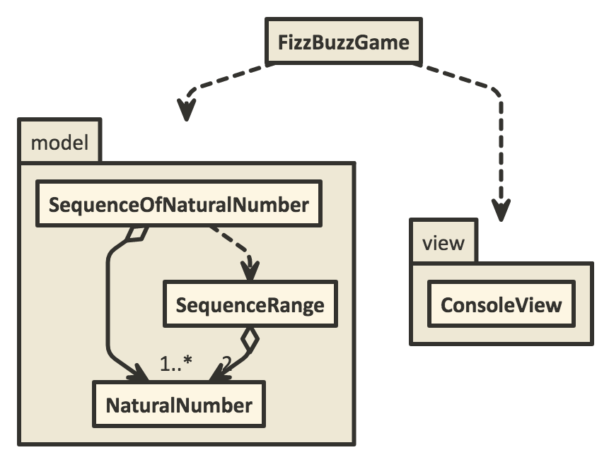

# FizzBuzzをOOPに忠実に実装する

## FizzBuzz？

Fizz Buzz(wikipedia) https://ja.wikipedia.org/wiki/Fizz_Buzz

### specification description

* 連続した自然数の数列の各項を次のルールで変換し、その結果を半角スペース区切りでコンソールに出力する。
* 変換ルール
  * 3の倍数なら「Fizz」と表示する
  * 5の倍数なら「Buzz」と表示する
  * 3と5の倍数なら「FizzBuzz」と表示する。
  * いずれにも該当しない場合は、自然数をそのまま表示する。
* プログラムに対する入力としては数列の初項と末項が与えられる。 

### output example

```text
1 2 Fizz 4 Buzz Fizz 7 8 Fizz Buzz 11 Fizz 13 14 FizzBuzz 16 17 Fizz 19 Buzz Fizz 22 23 Fizz Buzz 26 Fizz 28 29 FizzBuzz 31 32 Fizz 34 Buzz Fizz 37 38 Fizz Buzz 41 Fizz 43 44 FizzBuzz 46 47 Fizz 49 Buzz Fizz 52 53 Fizz Buzz 56 Fizz 58 59 FizzBuzz 61 62 Fizz 64 Buzz Fizz 67 68 Fizz Buzz 71 Fizz 73 74 FizzBuzz 76 77 Fizz 79 Buzz Fizz 82 83 Fizz Buzz 86 Fizz 88 89 FizzBuzz 91 92 Fizz 94 Buzz Fizz 97 98 Fizz Buzz
```

### diagram



### reference

1. １つのメソッドにつきインデントは１段階までにすること
2. else 句を使用しないこと
3. すべてのプリミティブ型と文字列型をラップすること
4. １行につきドットは１つまでにすること
5. 名前を省略しないこと
6. すべてのエンティティを小さくすること
7. １つのクラスにつきインスタンス変数は２つまでにすること
8. ファーストクラスコレクションを使用すること
9. Getter, Setter, プロパティを使用しないこと

ref. オブジェクト指向できていますか？(SlideShare) https://www.slideshare.net/MoriharuOhzu/ss-14083300
